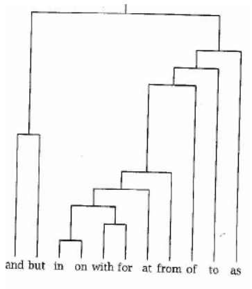

**Due date:** November 2 beginning of class.

# Question 1
Let a 5 x 4 data matrix X be defined as below. Find the following, and show your work/calculations. Note: You don't need to use any functions/packages on this question-- you should compute by hand.

```{r}
X <- matrix(c(-1,-2,4,2,0,0,-2,2,2,-1,-1,3,3,0,0,2,2,-3,1,1),nrow=5,byrow = T)
print(X)
```

a) Find the Euclidean distance between the first and second objects. Round the answer to have two decimal points. 

The Euclidean distance between the first and second objects is 6.40. I took the square of the difference between rows 1 and 2 of matrix X for each column (1,4,36,0), added them together to get 41, and took the square root to get 6.40.

b) Find the Manhattan distance between the first and third objects. Round the answer to have two decimal points.

The Manhattan distance between the first and third objects is 10.00. Fixing each column in sequence, I took the absolute value of the difference between rows 1 and 3 (|-1-2| + |-2-(-1)| + |4-(-1)| + |2-3|) and added the results to get 10.00.

c) Find the Minkowski distance ($\ro$ = 3) between the second and third objects. Round the answer to have two decimal points.  

The Minkowski distance between the second and third objects is 5.36. As before, fix each column, take the absolute difference between rows 2 and 3 (|-1-2|,|-2-(-1)|,|4-(-1)|,|2-3|), cube each term (3^3 ,1^3 , 5^3 , 1^3), add everything together to get 154, and take the cube root to get 5.36.

# Question 2
a) Use the filter and select commands to choose only vans from the `Cars93` data set. Select the variables (in this order) Model, Price, EngineSize, Horsepower, MPG.highway, and Length. Name this object `Vans93`. Note: Be sure to load the `dplyr` package after loading `MASS` to prevent masking of the select command. How many objects does `Vans93` have? Print the `Vans93` dataframe in your solutions. Note2: If you get any errors with `select()`, try using `dplyr::select()` to avoid conflicts in `dplyr` and `MASS` packages.
```{r}
library(MASS)
library(dplyr)

Vans93 <- Cars93 %>%
  filter(Type=="Van") %>%
  dplyr::select(Model, Price, EngineSize, Horsepower, MPG.highway, Length)
print(Vans93)
nrow(Vans93)
```
Vans93 has 9 objects.

b) Use the `dist` and `as.matrix` functions to find the distance matrix for the vans set using the Euclidean metric. Call this matrix `Vans_Euclidean`. You will need to remove the first column of the `Vans93` dataframe when you pass it into the `dist` function, since the variable `Model` is not an appropriate variable for the cluster variate. You can do this by passing in `Vans93[,-1]` or `Vans93[,2:6]` (or any other way you like), converting it to a matrix and storing it as `Vans_Euclidean`. Next, set the row and column names of `Vans_Euclidean` to the Models of the vans using the rownames and colnames functions, so that it is easier for us to see what object we have in each row/column. Hint: This can be done by typing

```
colnames(Vans_Euclidean)<-Vans93[,1]
rownames(Vans_Euclidean)<-Vans93[,1]
```

Finally, round the values in this matrix to the hundredths place (two decimal points). Paste the final version of the matrix `Vans_Euclidean` into your solutions. Which two Vans (give the models) have the shortest distance between them? Which two have the largest distance between them?
```{r}
Vans_Euclidean <- as.matrix(dist(Vans93[,-1], method = "euclidean"))
colnames(Vans_Euclidean)<-Vans93[,1]
rownames(Vans_Euclidean)<-Vans93[,1]
Vans_Euclidean <- round(Vans_Euclidean,2)
Vans_Euclidean
```
The Aerostar and the Caravan have the shortest distance between them (3.44), whereas the Eurovan and the Lumina APV have the largest distance (61.80).


c) Repeat the steps in part (b) but use the Manhattan metric and call the object `Vans_Manhattan`.
```{r}
Vans_Manhattan <- as.matrix(dist(Vans93[,-1], method = "manhattan"))
colnames(Vans_Manhattan)<-Vans93[,1]
rownames(Vans_Manhattan)<-Vans93[,1]
Vans_Manhattan <- round(Vans_Manhattan,2) # unrounded gives the shortest and longest distances written below
Vans_Manhattan
```

The vans with the shortest distance between them are the Quest and the MPV (5.0). The vans with the largest distance between them are the Lumina APV and the Eurovan (76.7).

# Question 3
Suppose you are given the following 6 x 6 *distance matrix*:
```{r}
D <- matrix(c(0,1,9,2,1.6,8,1,0,3,6,9,4,9,3,0,5,10,3,2,6,5,0,2,7.5,1.6,9,10,2,0,5.5,8,4,3,7.5,5.5,0),nrow=6,byrow = T)
print(D)
```

Find (by hand) the inter-group distance between A = $\{O_1, O_4\}$ and B = $\{O_2, O_3, O_5\}$ (where $O_n$ denotes the $n$th object in the distance matrix **D**) using

a) Nearest-neighbor

The nearest-neighbor distance between A and B is 1, between O_1 and O_2, which we get by evaluating min{1,9,1.6,6,5,2}; that is, all the possible combinations of elements of A with elements of B.

b) Farthest-neighbor

The farthest-neighbor distance between A and B is 9, between O_1 and O_3, which we get by evaluating max{1,9,1.6,6,5,2} for the same reason as before.

c) Average-neighbor

The average-neighbor distance before A and B is (1/(2*3))(1+9+1.6+6+5+2)=(1/6)(24.6)=4.1, adding together the terms from 3ab and dividing by the product of how many elements are in each group.

# Question 4
Consider the following dendrogram created by a hierarchical clustering of 11 frequently used English words.



Using this dendrogram, break these 11 words into five clusters. Call them $C_1 – C_5$ and put their members inside curly brackets, e.g. $C_2 = \{with, for\}$. Comment on your grouping using 1-2 sentences. {Not graded}

$C_1 = \{in, on\}$
$C_2 = \{with, for\}$
$C_3 = \{at, from\}$
$C_4 = \{of, to, as\}$
$C_5 = \{and, but\}$

I chose $C_1$ and $C_2$ the way I did because those two pairs exist under the same internal node, whereas $C_3$ is a bit further out in the dendrogram and would be clustered together with $C_1$ and $C_2$ before being combined with the rest of the set. Meanwhile, $C_4$ and $C_5$ are clusters in their own right because visually they consist of words closer to each other than to anything outside the cluster. 

# Question 5
Let's practice hierarchical clustering with the `vertebrate` dataset that is saved in the hw folder on GitHub. Animals are divided into two categories [vertebrates and invertebrates](https://www.oum.ox.ac.uk/thezone/animals/animalid/divide.htm#:~:text=Invertebrates%20-%20animals%20without%20a%20backbone,a%20vertebrate%20or%20an%20invertebrate.). Vertebrates are also divided within themselves into groups such as mammals, birds, reptiles.. Our task in this question is to identify groups within vertebrates that share similar traits.

a) First, read in the `vertebrate.csv` file and store it in a dataframe object named `vertebrate`. How many rows does the dataframe have? Print the entire dataset in your solutions.
```{r}
vertebrate <- read.csv("vertebrate.csv")
nrow(vertebrate)
vertebrate
```

b) Perform two separate clustering analyses of the data using the `hclust` function. Provide the dendrograms for both clustering methods.

(i)	using the Euclidean metric with complete linkage. Note: Similar to Question 2, start by creating a distance matrix named `vertebrate_euclidean` which should not include any text column. Add row and column names to the matrix from the `vertebrate` dataframe. Then apply `dist()` once again before feeding the matrix into `hclust()` function.
```{r}
Ver_Euclidean<-as.matrix(dist(vertebrate[,-1]))
colnames(Ver_Euclidean) <- vertebrate[,1]
rownames(Ver_Euclidean) <- vertebrate[,1]
Ver_Euclidean <- dist(Ver_Euclidean)
Ver_Euclidean_HC <- hclust(Ver_Euclidean,method="complete")
Ver_Euclidean
plot(Ver_Euclidean_HC, lwd=3, xlab="Vertebrates", cex.lab=1.25, main="Clustered vertebrates, Euclidean metric,\n Complete linkage", sub="", hang=-1)
```

(ii)using the Manhattan metric with single linkage and
```{r}
Ver_Manhattan<-as.matrix(dist(vertebrate[,-1]), metric="Manhattan")
colnames(Ver_Manhattan) <- vertebrate[,1]
rownames(Ver_Manhattan) <- vertebrate[,1]
Ver_Manhattan <- dist(Ver_Manhattan)
Ver_Manhattan_HC <- hclust(Ver_Manhattan,method="single")
Ver_Manhattan
plot(Ver_Manhattan_HC, lwd=3, xlab="Vertebrates", cex.lab=1.25, main="Clustered vertebrates, Manhattan metric,\n Single linkage", sub="", hang=-1)
```

Which method do you prefer?

I prefer the first method (Euclidean with complete linkage) because the vertebrates clustered together tend to be more intuitively related. For example, with complete linkage, komodo and turtle are clustered before being paired as a cluster with penguin; single linkage puts them all on the same tier. Complete linkage seems more precise in how it separates data into clusters.

In your dendrograms:

*	Set the line width to 3 using `lwd=3`
*	Set the title to "Clustered vertebrates, Metric type,\n Linkage type" (You should enter the metric and linkage used in the clustering.)
*	Remove the subtitle by setting `sub=""`.
*	Set the x-axis label to Vertebrates using `xlab="Vertebrates"` with `cex.lab=1.25`
*	Have the terminal edges extend to a height of zero by setting `hang=-1` such that labels appear on the same vertical height.


Bonus: (not required) generate the same dendrogram using the `ggdendro` package.

```{r}
# install.packages("ggdendro")
# ggdendrogram(Ver_Euclidean_HC)
# can't get this to work
```


You are done! 🏁 Don't forget to commit and push your .Rmd file to your Github repository before the due date.


